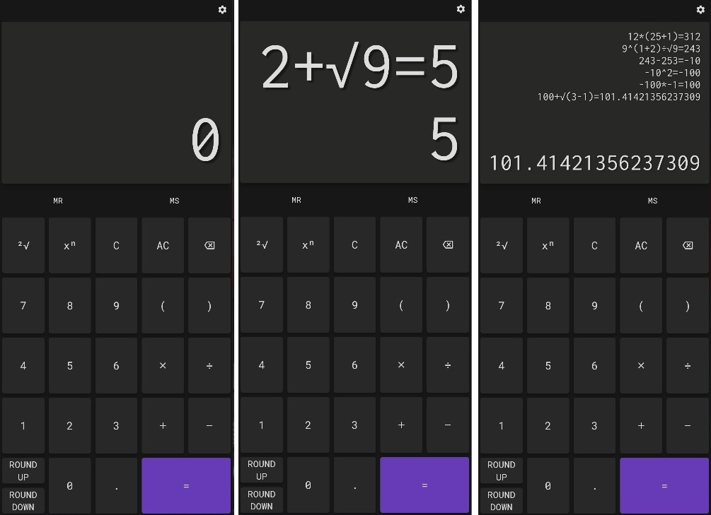

# Math Expression Calculator

A calculator with the capabilities to evaluate complex math expressions.

## About this project:

The main goal of this project is to serve as a starting point on a Flutter Developer career.

This project will be used for:
- putting in practice the coding techniques, ideas and concepts learned;
- keeping track of my progress through the development of this app;
- keeping track of my flutter coding skills improvement.

### Phases of development (TODO list):

**PHASE 1:**
  - Change the vars _display  / _displayHistory to double, AND
    only convert them to String when they have to de displayed (try toInt())
  - Implement a WrapAround mode for the display in order to increase the size of
      digits on display when needed.
  - Add thousand separator e.g. 1,000,000.00
  - Create a Scientific Notation function in order to display big numbers.
  - Implement a way for history to display the full equation

**PHASE 2:**
  - Create a new view.
  - Implement a basic math equation solver screen

**PHASE 3:**
  - Create a new view.
  - Implement a more complex calculator.
  - Percentages and interest converter (juros aa -> am -> ad / ad -> am -> aa)

**PHASE 4:**
  - Create a new view.
  - Allow the user to customize the app:
    - Build two sliders:
      - Slider 1: primatySwatch color
      - Slider 2: brightness level
    - Identify based on brightness level if the theme is light or dark

