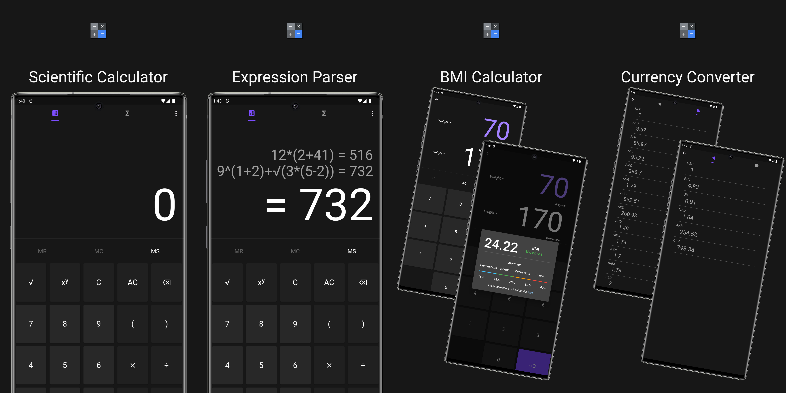

# Math Expression Calculator

A Flutter Application that includes a Scientific Calculator, Mathematical Expressions Parser, BMI Calculator, Currency Converter, with real time exchange rates, favorites tab and more!

##

The Math Expression Calculator is, at its core, a [Mathematical Expression Parser](https://www.google.com/search?q=mathematical+expression+parser).

## 

## Features:
- [x] You can input complex math expressions.
- [x] The parser can evaluate expressions containing Square Root, Power, Multiplication, Division, Subtraction, and Addition.
- [x] The parser has full support for parentheses, including nesting.
- [x] The parser recognizes [Implicit Multiplications](https://www.google.com/search?q=implicit+multiplication)
- [x] The parser follows the [Order of Operations](https://en.wikipedia.org/wiki/Order_of_operations).
- [X] Used mathematical expression are displayed in history.
- [x] Users can retrieve previously used math expressions by clicking on them.
- [x] Users can store and retrieve results using 'MS', 'MC' and 'MR' controls.
- [x] Users can easily calculate their [Body Mass Index.](https://en.wikipedia.org/wiki/Body_mass_index)
- [x] Responsive Design
- [x] Real-time Currency Converter
- [ ] Scientific Notation
- [ ] Language Selection (English, Portuguese, Spanish).
- [ ] Customization (Switch Dark/Light Mode, select accent color).
- [ ] Equation Parser (1st and 2nd-degree).
- [ ] Interest Converter (daily -> monthly -> annual, and vice-versa).
- [ ] Unit Converter (Mass, Length, Speed, etc).
- [ ] OnScreen cursor.
- [ ] Real-time Refactoring.
- [ ] Theme customization (primary color and dark mode).
- [ ] Integration with other apps or services, such as cloud storage, database, google account sign in, etc. (this will not have any practical effects, it will serve only as a study project).
- [ ] Deploy project to PlayStore.

## 

## About this project:

The primary objective of this project is to provide a foundation for a career as a Flutter Developer.

The project serves the following purposes:

- Implement coding techniques, ideas, and concepts acquired during the course of learning.
- Monitor my progress in the development of the application.
- Track improvements in Flutter, Dart, and general coding skills.
## 

## The Developer:

This entire project was idealized and developed by Lucas Mariano, an enthusiast and aspiring Flutter Developer. You check more of my work on my [GitHub page.](https://github.com/lucas-marianno)

##

